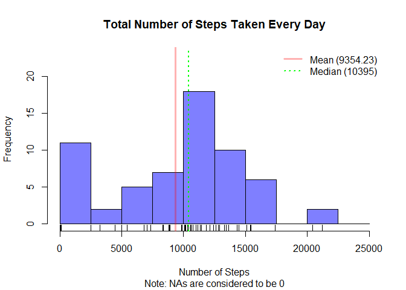
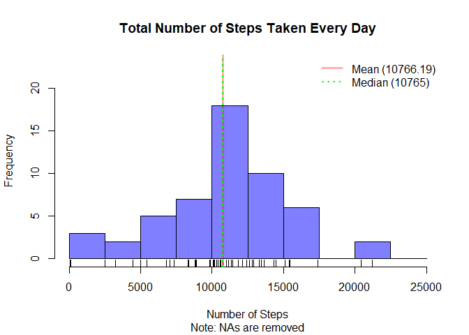
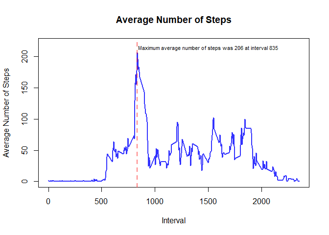
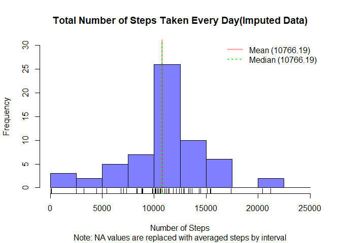
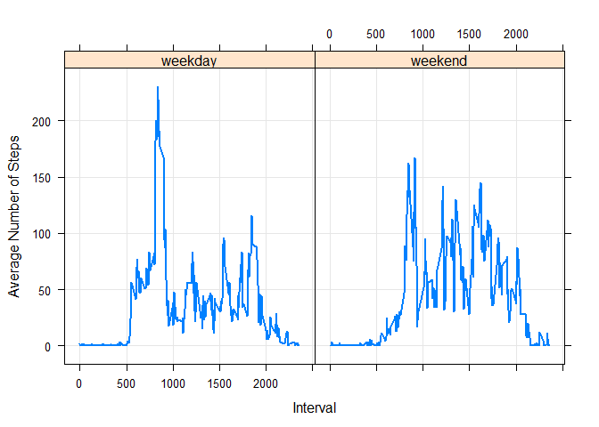

## Loading and preprocessing the data

'RepData_PeerAssessment1-master.zip' was downloaded using "Clone/Download" option on GitHub. After setting the working directory, zip file was unzipped. Activity records are storred in another zip-file - "activity". Therefore 'unzip' function was called again. Finally, 'activity.csv' was read into R with 'read.csv' function and stored in the data frame 'df'. Following code represents the above-mentioned manipulations.


```r
library(knitr)
```

```
## Warning: package 'knitr' was built under R version 3.4.4
```

```r
opts_chunk$set(tidy.opts=list(width.cutoff=55),tidy=TRUE, fig.path = 'Figures/')
```


```r
setwd("~/Coursera/DataScience/Notes/Reproducible Research")
unzip("RepData_PeerAssessment1-master.zip", exdir = getwd())
setwd("~/Coursera/DataScience/Notes/Reproducible Research/RepData_PeerAssessment1-master")
unzip("activity.zip", exdir = getwd())
df <- read.csv("activity.csv", header = TRUE, sep = ",")
```
Few other functions such as 'summary', 'str' and 'dim' could be used to get high level overview of the data.

## What is mean total number of steps taken per day?

'Aggregate' function can be used to calculate total number of steps taken each day. 'Sum' function is applied to the "step" column of the data set:


```r
n_steps <- aggregate(df$steps, by = list(df$date), sum, 
    na.rm = TRUE)
```
Call to 'aggregate' function also changes column names from "date" and "steps" to "Group.1" and "x" respectively.
'Mean' and 'median' functions can be called to calculate mean and median values for the number of steps taken on each day:


```r
mean(n_steps$x)
```

```
## [1] 9354.23
```

```r
median(n_steps$x)
```

```
## [1] 10395
```
Although 'na.rm = TRUE' when 'aggregate' function is called, it simply substitutes all NA values with 0. Therefore, output data would be skewed towards 0 to some extent.

It is useful to name columns in more recognizable way before plotting the results:


```r
colnames(n_steps) <- c("Date", "Steps")
```
Output is to be plotted by calling 'hist' function. Color and transparency can be set with  'rgb' and number of bins with 'breaks'. Note is also added at the bottom as a subtitle to indicate that all NA values are set to be 0. In addition, vertical lines show mean and median for the number of steps. Legend is shown at the topright corner of the chart. Rug is added at the bottom of histogram for more informative representation of data.


```r
hist(n_steps$Steps, col = rgb(0, 0, 1, 0.5), xlab = "Number of Steps", 
    main = "Total Number of Steps Taken Every Day", breaks = seq(0, 
        25000, by = 2500), ylim = c(0, 23), sub = "Note: NAs are considered to be 0")
rug(n_steps$Steps)
abline(v = mean(n_steps$Steps), col = rgb(1, 0, 0, 0.3), 
    lwd = 3)
abline(v = median(n_steps$Steps), col = "green", lty = 3, 
    lwd = 2)
legend("topright", legend = c("Mean (9354.23)", "Median (10395)"), 
    col = c(rgb(1, 0, 0, 0.3), "green"), lty = c(1, 3), 
    lwd = c(3, 2), box.lty = 0)
```




So far 'aggregate' function has been used in its default way. Another approach is to use it by setting the formula (e. g. y ~ x). Interestingly, it produces different result comparing to default method. Unlike default, the function removes NA values rather than converting them to 0. Therefore, output data frame becomes shorter, but there is no skewness to 0. The following code is to generate new output for the 'aggregate' function and then plot it in the form of histogram, also displaying the rug, mean and median values as vertical lines. A note is added as a subtitle indicating that NA values are being removed. New values for mean and median number of steps are calculated.


```r
n_steps1 <- aggregate(steps ~ date, data = df, sum)
mean(n_steps1$steps)
```

```
## [1] 10766.19
```

```r
median(n_steps1$steps)
```

```
## [1] 10765
```

```r
hist(n_steps1$steps, col = rgb(0, 0, 1, 0.5), xlab = "Number of Steps", 
    main = "Total Number of Steps Taken Every Day", breaks = seq(0, 
        25000, by = 2500), ylim = c(0, 23), sub = "Note: NAs are removed")
rug(n_steps1$steps)
abline(v = mean(n_steps1$steps), col = rgb(1, 0, 0, 0.3), 
    lwd = 3)
abline(v = median(n_steps1$steps), col = "green", lty = 3, 
    lwd = 2)
legend("topright", legend = c("Mean (10766.19)", "Median (10765)"), 
    col = c(rgb(1, 0, 0, 0.3), "green"), lty = c(1, 3), 
    lwd = c(3, 2), box.lty = 0)
```




Columns are not renamed when 'aggregate' is used in formula method. Therefore, original column names "date" and "steps" can be used for plotting.

Mean and median become much closer to each other than in previous case while leftmost bar of the histogram which includes 0 becomes much shorter. Applying 'dim' function to the "n_steps" now returns 53 lines instead of 61 in case of default settings for 'aggregate' function.

## What is the average daily activity pattern?

In order to calculate average number of steps per each 5 minute interval, data on the number of steps needs to be aggregated by the time interval. Next 'mean' function can be applied to such data set:


```r
n_steps_ave <- aggregate(df$steps, by = list(df$interval), 
    mean, na.rm = TRUE)
```
The output stored in "n_steps_ave" has 2 columns which were renamed after using 'aggregate' function. It is useful to have them renamed to "interval" and "steps":


```r
colnames(n_steps_ave) <- c("interval", "steps")
```
Following lines of code determine the maximum value of the average number of steps per each 5 minute interval and identify the time interval corresponding to this value:


```r
max(n_steps_ave$steps)
```

```
## [1] 206.1698
```

```r
n_steps_ave[which(n_steps_ave$steps == max(n_steps_ave$steps)), 
    ]
```

```
##     interval    steps
## 104      835 206.1698
```
Thus, maximum average number of steps was equal to 206 and occured at time interval 835.
Next, average number of steps is plotted against time using 'plot' function. Vertical line identifies a time period corresponding to the maximum number of average steps.


```r
plot(n_steps_ave$interval, n_steps_ave$steps, type = "l", 
    col = rgb(0, 0, 1, 0.8), lwd = 2, xlab = "Interval", 
    ylab = "Average Number of Steps", main = "Average Number of Steps", 
    ylim = c(0, 220))
abline(v = 835, col = rgb(1, 0, 0, 0.5), lwd = 2, lty = 2)
legend(750, 225, legend = c("Maximum average number of steps was 206 at interval 835"), 
    cex = 0.7, bty = "n")
```




## Imputing missing values

Number of rows with NA values is calculated using 'is.na' function applied to the column "steps" of the data frame "df" which was previously read into R from "activity.csv". The output of 'is.na' is stored in logical vector "na". Next, fraction of NA values is to be found as ratio of the sum of "na" vector to its length.


```r
na <- is.na(df$steps)
sum(na)
```

```
## [1] 2304
```

```r
na_frac <- sum(na)/length(na)
na_frac
```

```
## [1] 0.1311475
```
Thus, the fraction of NA values in the dataset is approximately 13%.
The strategy to fill in NA values is going to be replacement of all NAs with the average number of steps for this 5 minute interval. Average number of steps can be identified with 'aggregate' function. Afterwards, columns will be renamed as "interval" and "mean". The column containing mean values is to be repeated over the length of the column of original data frame so that it can be 'cbind' -ed to this data frame.


```r
steps_ave <- aggregate(df$steps ~ df$interval, data = df, 
    mean)
colnames(steps_ave) <- c("interval", "mean")
rep_steps <- rep(steps_ave$mean, times = length(df$steps)/length(steps_ave$mean))
ndf <- cbind(df, steps_ave$mean)
```
Next rename columns so that it is easy to refer them:


```r
colnames(ndf) <- c("steps", "date", "interval", "mean")
```
New vector "nndf" stores the values for the number of steps where NA values are substituted with mean number of steps while keeping all other numeric vlaues the same as in original data frame:


```r
nndf <- ifelse(is.na(ndf$steps), ndf$mean, ndf$steps)
```
Finally, the newly produced vector "nndf" with all NA vlaues replaced is to be merged with the original data frame. The new column is named "Steps" with capital "S" in order to differentiate from column containing original data ("steps") with NA values. Keeping both columns also helps in double checking that all NA values were replaced. This can be done with 'is.na' function.


```r
nnndf <- cbind(ndf, nndf)
colnames(nnndf)[5] <- "Steps"
```
Resulting data frame "nnndf" has all data including the column "Step" with all NA values replaced.

Next, mean and median are determined for the new dataset. Finally, data for the number of steps are aggregated by date and summed. The results are plotted using 'hist' function with vertical lines corresponding to mean and median.


```r
aggr_nnndf <- aggregate(Steps ~ date, data = nnndf, sum)
mean(aggr_nnndf$Steps)
```

```
## [1] 10766.19
```

```r
median(aggr_nnndf$Steps)
```

```
## [1] 10766.19
```

```r
hist(aggr_nnndf$Steps, col = rgb(0, 0, 1, 0.5), xlab = "Number of Steps", 
    main = "Total Number of Steps Taken Every Day(Imputed Data)", 
    breaks = seq(0, 25000, by = 2500), ylim = c(0, 30), 
    sub = "Note: NA values are replaced with averaged steps by interval")
rug(aggr_nnndf$Steps)
abline(v = mean(aggr_nnndf$Steps), col = rgb(1, 0, 0, 0.3), 
    lwd = 3)
abline(v = median(aggr_nnndf$Steps), col = "green", lty = 3, 
    lwd = 2)
legend("topright", legend = c("Mean (10766.19)", "Median (10766.19)"), 
    col = c(rgb(1, 0, 0, 0.3), "green"), lty = c(1, 3), 
    lwd = c(3, 2), box.lty = 0)
```




Mean and median values for the new dataset with imputed data are the same.

## Are there differences in activity patterns between weekdays and weekends?

Data frame "nnndf" generated above does not contain NA values. First, "date" column has to be transformed to the date type of vector before creating factor variable.


```r
nnndf$date <- as.Date(nnndf$date, "%Y-%m-%d")
```
Factor variable "weekday" will have 2 labels "weekend" and "weekday", and, therefore, 2 levels: "TRUE" and "FALSE". Vector "wkend" will be assigned 2 values related to the weekends. This will be used to identify the level when generating the factor variable.


```r
wkend <- c("Saturday", "Sunday")
nnndf$weekday <- factor(weekdays(nnndf$date) %in% wkend, 
    levels = c(FALSE, TRUE), labels = c("weekday", "weekend"))
```
In order to find weekday and weekend patterns data from "nnndf" are to be aggregated by interval and weekday with 'mean' function applied to the "Step" column:


```r
wd_steps3 <- aggregate(Steps ~ interval + weekday, data = nnndf, 
    mean)
```
Finally, average number of steps is plotted using lattice system for weekends and weekdays.


```r
library(lattice)
```

```
## Warning: package 'lattice' was built under R version 3.4.4
```

```r
xyplot(wd_steps3$Steps ~ wd_steps3$interval | wd_steps3$weekday, 
    type = "l", xlab = "Interval", ylab = "Average Number of Steps", 
    grid = TRUE, lwd = 2)
```




As can be seen from the plots, average number of steps is higher during weekdays, but the values are more uniformly distributed over time on weekends.
